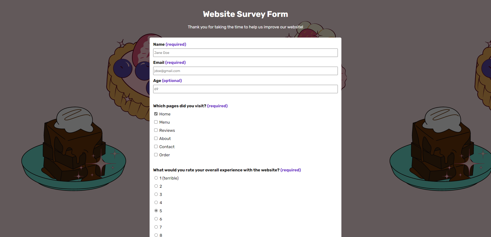

# Survey Form 📝

**[You can find the live website here.](https://firebreather65.github.io/fcc-survey-form/)**

## Inspiration
This is my submission for freeCodeCamp's [Survey Form certification project](https://www.freecodecamp.org/learn/2022/responsive-web-design/build-a-survey-form-project/build-a-survey-form)! The theme was inspired by my need for a survey form for Sweet Comforts Bakery website testers. I was going to use Google Forms, but because of the certification project I decided to make my own.

## Features
This is a fully responsive website. The UI was taken from the [original website's UI kit](https://www.figma.com/file/dlOTyhKuJRPiPpvfZjy7lr/SCB's-Website?type=design&node-id=3%3A2&mode=design&t=t3wYxzvDPk8I8Jdp-1), save for the font (that's just one of my favorites 🙂).

## Technologies
This website was built with HTML and CSS, with a bit of JavaScript to create a popup alert when the user clicks "Submit".

## What I learned
I learned a lot about HTML forms while creating this project, most notably `<input>` types and attributes. I also learned how to create a popup alert in Javascript!

## Future plans
I'd love to fix the 405 error that occurs upon form submission. I'd also love to learn a server-side language to save the user's inputs to a database.
